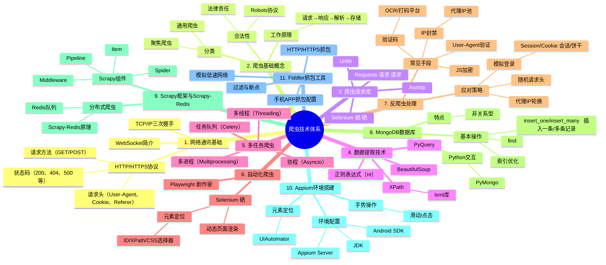

<h1>爬虫基础学习</h1>
<h5>（需要一点python基础）</h5>

```mermaid   “‘美人鱼
mindmap
  root((爬虫技术体系))
    1. 网络通讯基础
      HTTP/HTTPS协议
        请求方法（GET/POST）
        状态码（200、404、500等）
        请求头（User-Agent、Cookie、Referer）
      TCP/IP三次握手
      WebSocket简介
    2. 爬虫基础概念
      工作原理
        请求→响应→解析→存储
      合法性
        Robots协议
        法律责任
      分类
        通用爬虫
        聚焦爬虫
    3. 爬虫请求库
      Requests   请求   请求
      Urllib
      Aiohttp
      Selenium   硒   硒
    4. 数据提取技术
      正则表达式（re）
      XPath
        lxml库
      BeautifulSoup
      PyQuery
    5. 多任务爬虫
      多线程（Threading）
      多进程（Multiprocessing）
      协程（Asyncio）
      任务队列（Celery）
    6. 自动化爬虫
      Selenium   硒
        元素定位
          ID/XPath/CSS选择器
        动态页面渲染
      Playwright   剧作家
    7. 反爬虫处理
      常见手段
        User-Agent验证
        IP封禁
          代理IP池
        验证码
          OCR/打码平台
        JS加密
      应对策略
        随机请求头
        代理IP轮换
        模拟登录
          Session/Cookie   会话/饼干
    8. MongoDB数据库
      特点
        非关系型
      基本操作
        insert_one/insert_many   插入一条/多条记录
        find
        索引优化
      Python交互
        PyMongo
    9. Scrapy框架与Scrapy-Redis
      Scrapy组件
        Spider
        Pipeline
        Middleware
        Item
      分布式爬虫
        Scrapy-Redis原理
        Redis队列
    10. Appium环境搭建
      环境配置
        JDK
        Android SDK
        Appium Server
      元素定位
        UIAutomator
      手势操作
        滑动/点击
    11. Fiddler抓包工具
      HTTP/HTTPS抓包
      过滤与断点
      模拟低速网络
      手机APP抓包配置
```
